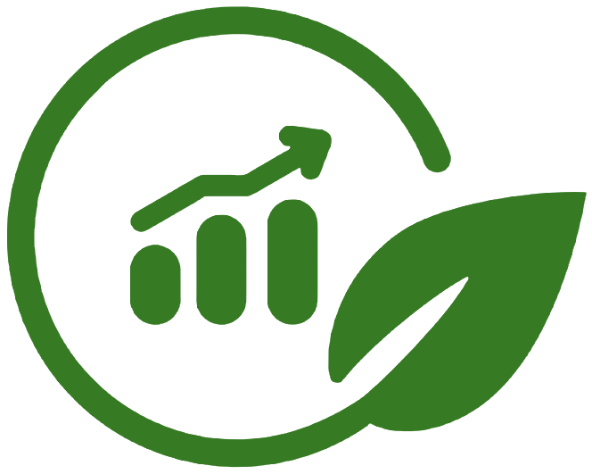

<p align="center">
  </p>

<h1 align="center">GLC Platform</h1>
<p align="center">Green Loan Cycle platform streamlines ESG-linked loan assessments automatically, identifying and measuring key metrics, making data capture on performance 30% easier with LMA framework and AI agents </p>
<p align="center"><strong><i>LMA Hackathon 2025 | Devpost</i></strong></p>


Table of Content
<p align="center">
  <a href="#-quick-demo">Quick Demo</a> •
  <a href="#-inspiration">Inspiration</a> •
  <a href="#-how-I-built-it">How I Built It</a> •
  <a href="#-key-features">Features</a> •
  <a href="#-for-judges">For Judges</a>
</p>

---
## Inspiration
Sustainability-linked loans with ESG are becoming increasingly in mainstream, as capital markets are rapidly linking the cost of debt to ESG performance. However, manual ESG due diligence, fragmented data across counterparties, and inconsistent KPI standards create operational bottlenecks in origination, covenant-linked pricing, monitoring, and reporting. My platform **"GLC"** brings together consistent ESG data, automates KPI-based credit assessments and covenant enforcement, and provides an _auditable borrower-lender workflow_ delivering transparent SLL management that meets LMA ESG Frameworks, industry's need. It could improve efficiency and speed by 30%.

## What it does
The "GLC Platform" provides a uniform platform for both borrowers and lenders, incorporating a compliance/monitoring framework that applies from loan origination throughout the entire life cycle of Green Loan Principles (GLP) and the LMA framework. It also offers services such as loan data resolution, loan assessment, sustainability checks, key stakeholder evaluation, loan balance sheet generation, and AI-assisted advice. This helps both borrowers and lenders reduce pressure, streamline processes, improve communication, and maintain compliance + reporting.

**GLC Platform developed to serve the needs of:**
- **Digitise** the LMA Green Loan Principles workflow
- **Automate** ESG metric extraction from borrower documents
- **Standardise** compliance scoring across all applications
- **Scale** sustainable finance without scaling headcount

## KEY FEATURES:
> Target Users:

### For Borrowers
▶ **Application Assessment Form:** Comprehensive loan form with ESG compliance questionnaires and Documents Upload<br>
▶ **Loan Assets Management:** Tracking and organizing loan documents with `LOAN_ID` and decentralized sharing across different shareholders for quick access <br>
▶ **Invite Collaborator and Shareholder:** Demo shareholders invitation with link<br>
▶ **Loan Audit"** View only access to audit pages for transparency<br>
▶ **Real-time Status:** Track application progress through review stages<br>
▶ **User Guide:** Guide and doucmentation to use platform<br>
▶ **Learning Resources:** SSL, ESG, and LMA resources to read to promote knowledge<br>

### For Lenders
▶ **Application Assessment Form:** Same comprehensive loan form with ESG compliance questionnaires and Documents Upload for lenders so that lenders can verify any loan from their end <br>
▶ **Loan Assets Management:** Same tracking and organizing loan documents with `LOAN_ID` and decentralized sharing across different shareholders for quick access <br>
▶ **Invite Collaborator and Shareholder:** Same demo shareholders invitation with link<br>
▶ **Dashboard:** To see all loans summary and quick overview<br>
▶ **Loan Audit** Full control to check loan assessment and analysis, loan cycle management and decision-taking capabilities<br>
▶ **GLP Compliance Check:** 4 core components validated automatically<br>
▶ **DNSH Assessment:** 6 EU Taxonomy criteria evaluated<br>
▶ **Carbon Lock-in Risk:** Stranded asset risk identification<br>
▶ **AI Document Chat:** Ask questions about uploaded sustainability reports<br>
▶ **Location Intelligence:** Project location mapping with environmental data<br>
▶ **User Guide:** Guide and doucmentation to use platform<br>
▶ **Learning Resources:** SSL, ESG, and LMA resources to read to promote knowledge<br>

## Development Roadmap
I started by exploring the LMA documents and resources at `lma.eu.com/sustainable-lending/` resources and the `LinkedIn community` to ensure the development adhered to industry standards. The hackathon version's architecture relies on open-source models, APIs, and libraries.

The GLC platform is built with a backend-first approach, utilising FastAPI for the backend, JavaScript for the frontend, Hugging Face and Langchain for AI tasks, as well as document and data processing libraries and open-source sustainable and environmental data APIs.


### Tech Stack

| Layer | Technology | Purpose |
|-------|------------|---------|
| **Backend** | Python 3.12 + FastAPI | High-performance async API |
| **Database** | SQLite + SQLAlchemy | Lightweight, portable storage |
| **Vector Search** | FAISS + Vector DB + MiniLM-L6-v2 | Semantic document search |
| **NLP/AI** | RoBERTa (QA) + Flan-T5 (RAG) | Document understanding |
| **Frontend** | Vanilla JS + TailwindCSS | Fast, responsive UI |
| **APIs** | Hugging Face and Open-meteo | For AI Models and Environmental Data |
| **PDF Processing** | pdfminer.six + PyPDF2 | Text extraction and export|

## Challenges I ran into
- Create an effective loan assessment form that collects only the necessary information for faster processing.
- Gathering, retrieving, and calculating key metrics
- Creating an AI RAG system with a compatible direct inference and maintaining sufficient context length.

## Accomplishments that I'm proud of
- Direct alignment with LMA GLP Framework and ESG (compliance + reporting). 
- Scalable & modular: API-first architecture means banks can plug it into existing stacks (agent banks, syndication, fund onboarding).
- Automatic calculation of high-impact metrics and ESG-principal compliance check: time saved in diligence, reduction in manual errors, faster deal execution - all judgeable.

## What I learned
1. Importance of Growing Sustainability-linked loans
2. Role of different parties involved in a loan, such as borrower, lenders, investors, agents, regulators, ESG, and civil society and how all collaborate together on ESG truth.
3. Capturing and verifying ESG data across different areas and making it distributed and accessible along with its syndication.
4. How to serve an AI agent with direct inference?

## What's next for GLP Cycle
1. Automatic loan assessment filing by uploading the company's sustainability-linked report document and annual report.
2. Collaborate with the loan market professional and ESG reviewers to test and scale the platform for real-world tasks.
3. Connect it with existing tools and solutions to enhance functionality and load balance.
4. Add a robust **finance agent** to research the company's profile and provide reliable financial information.


## 📈 Business Impact

| Metric | Before GLC | With GLC |
|--------|------------|----------|
| Assessment Time | 2-3 weeks | < 1 hour |
| Consistency | Variable | Standardized |
| Compliance Coverage | Partial | 100% GLP + DNSH |
| Portfolio Visibility | Spreadsheets | Real-time Dashboard |

---

## Quick Start (Local Setup)

#### Prerequisites
- Python 3.12+
- Conda (recommended) or pip

#### Installation

```bash
# 1. Create environment
conda create --prefix .\.conda_env python=3.12 -y
conda activate .\.conda_env

# 2. Install dependencies
pip install -r requirements.txt

# 3. Run the application
uvicorn app.main:app --reload --port 8000

# 4. Open browser
http://localhost:8000
http://127.0.0.1:8000/
```

#### Login
- Choose your user role, **Lender** or **Borrower** and enter name and create `6-digit` passcode and do login
> Remember your username and passcode to login again

#### Start using:
- Fill a new loan application form with required documents and submit it
- Manage your loan data from **Loan Assets** page
- Check your loan audit and analysis on **Audit** page
- 🛈 For more, please read the **Docs** and **Learn** page in sidebar.

### API Documentation
- **Swagger UI**: http://localhost:8000/docs
- **ReDoc**: http://localhost:8000/redoc


<p align="center">
  <strong>Built with 💚 for Sustainable Finance | Adya Prasad</strong>
</p>
